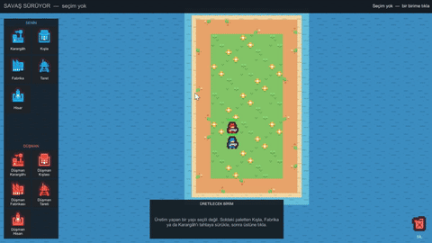

# CountryBall Strategy

<!-- GIF slot. When Media/gameplay.gif exists, replace the single italic line
     below with exactly this line:
     
-->
*Gameplay GIF pending — the scene is not wired in the editor yet, and the
repo's own gate (`Tools/check-asset-inventory.py`) counts exactly what is
missing.*

A turn-based tactics core on a grid, with a structure/production layer on top.
Built in Unity 2021.3.45f2 as a learning project with one working rule:
**no design decision ships without a measured justification.**

This is not a finished game today. The battle rules, the production layer and
463 tests are done; wiring the scene together in the editor is the current
work, and the repo reports that gap itself instead of hiding it.

## The thesis, in three measurable pieces

**1. The engine boundary is a compiler error, not a convention.**
`GridStrategy.Core`, `.Combat` and `.Battle` set `noEngineReferences: true` in
their `.asmdef` files. The generated `GridStrategy.Combat.csproj` contains
zero references to UnityEngine, so typing `ScriptableObject` inside the combat
core fails with CS0246 instead of waiting for a code review to catch it.

**2. A closed defect is nailed into a test name.**
A placed structure kept its placer's identity — a live defect. It was fixed
(`9db044b`), then the test file whose absence had hidden it was added
(`0c8225f`), and the defect is now pinned so it cannot silently return:
`CommitPlacement_GivesTheStructureItsOwnIdentity_NotThePlacers` in
`Assets/Tests/EditMode/Unity/BoardAdapterTests.cs`.

**3. The tenth gate audits a layer the other nine never read — and prints its
own blind spots on every run.**
Nine gates check the docs, the comments and their cross-references; all nine
are green. The tenth, `check-asset-inventory.py`, audits the scene/prefab
wiring layer and is deliberately red today: 7 violations, every one an
editor-side task. Each run ends with a "what this gate cannot see" list, so a
green result never claims more than it measured.

## Measured state

| What | Value | Measured by |
|---|---|---|
| Production code | 46 `.cs` files, 47 types | `find Assets/Game -name '*.cs'`; declaration-anchored grep, self-tested on known-good and known-bad input |
| Tests | 463 / 463 passing | `Tools/run-editmode-tests.ps1` (run fresh for this README) |
| Machine gates | 10 scripts, 9 green, 1 deliberately red | loop in "Running it" below |
| Documentation | 73 Markdown files under `Docs/` | `find Docs -name '*.md'` |
| Assemblies | 8 `.asmdef`, engine-free enforced in 3 | `noEngineReferences` field of each `.asmdef` |
| Unity version | 2021.3.45f2 | `ProjectSettings/ProjectVersion.txt` |

## The documentation is Turkish — a decision, not an accident

`Docs/` is the project's learning journal. `Docs/deep/kod/` holds per-type
rationale mirrors, `Docs/deep/konular/` narrates mechanisms that span files,
`Docs/deep/dil/` covers each borrowed C# / BCL feature, and `Docs/ogrenme/`
is a separate notebook with a reading order. Translating it would flatten
exactly the nuance it exists to record. Type and member names and commit
messages are English; comments are Turkish, and a gate
(`check-comment-language.py`) enforces that they carry full diacritics.
Start at [`Docs/README.md`](Docs/README.md).

## Running it

```
git clone https://github.com/Seyien/CountryBall-Strategy.git
```

Open with Unity **2021.3.45f2**. The EditMode tests run from the command line
without touching the editor:

```powershell
powershell -File Tools\run-editmode-tests.ps1
```

The ten gates are plain Python, run here from Git Bash:

```bash
# rc is captured on its own line on purpose: putting $? inside the echo after
# a command substitution reports the substitution's exit code — always 0.
for g in Tools/check-*.py; do
  python "$g" > /dev/null 2>&1; rc=$?
  echo "$(basename "$g") rc=$rc"
done
```

Expected today: nine gates at `rc=0`, `check-asset-inventory.py` at `rc=1`.

## What does not work yet

The game is not playable: the scene is not wired in the editor. Two blueprint
types have no `.asset` instances, four view scripts sit on no scene object,
and one serialized field key is missing — exactly the 7 violations
`check-asset-inventory.py` prints. Run the gate rather than trusting this
paragraph: it will say so itself when the wiring is done.

## Art

All sprites are from Kenney (Tiny Battle, Tiny Dungeon, Tiny Town), licensed
CC0 1.0. Attribution is not required; a manifest recording the archive
SHA-256 hashes lives at
[`Assets/Art/THIRD_PARTY_ASSETS.md`](Assets/Art/THIRD_PARTY_ASSETS.md).
